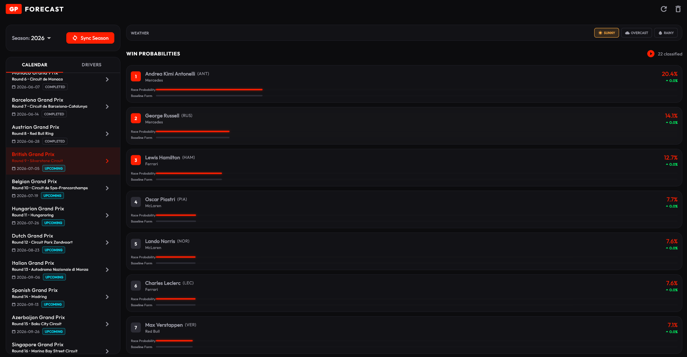
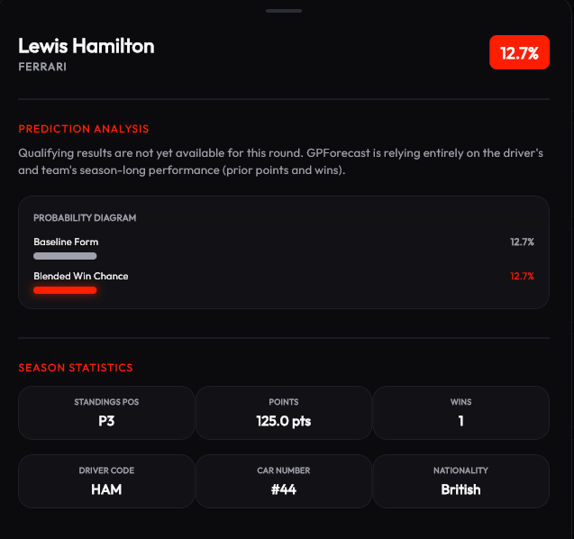
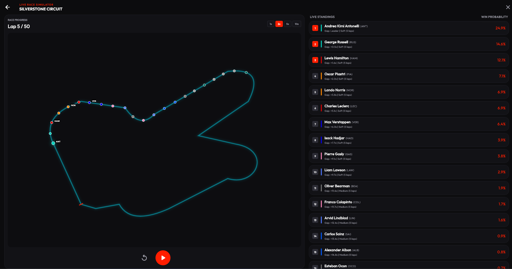

# GPForecast

GPForecast is a client-side Formula 1 race win probability predictor built using **Flutter and Dart**. It targets mobile (phones and tablets) and Windows Desktop from a single, responsive codebase. 

The application utilizes an offline-first **SQLite database** to cache F1 stats and runs a lightweight **Bayesian prediction engine** directly on the device, allowing calculations to execute in less than a millisecond with zero server hosting costs.

---

## User Interface Screenshots

### Main Dashboard and Dynamic Weather Adjustments


### Driver Statistics and Performance History


### Live Race Telemetry and Overtaking Simulator


---

## Features

- **Offline-First Architecture**: Automatically downloads F1 schedules, driver standings, and qualifying/race results using the **Jolpica REST API** (the Ergast F1 API successor) and caches them in a local SQLite database.
- **On-Device Bayesian Predictor**: Dynamically computes race winning probabilities on the client side based on driver standings baseline form, starting grid slots, and circuit-specific overtaking coefficients.
- **Adaptive Glassmorphic UI**: A dark carbon-fiber design system featuring semi-transparent glassmorphic panels, F1-red accents, and status indicators that automatically rearrange to fit mobile screens, tablet formats, and wide desktop windows.
- **Unit Testing Coverage**: Includes automated FFI database tests ensuring that prediction calculations sum to exactly 100% and scale properly based on circuit characteristics.

---

## Tech Stack

- **Core Language**: Dart
- **UI Framework**: Flutter
- **State Management**: Riverpod (`flutter_riverpod`)
- **Local Database**: SQLite (`sqflite` on mobile, `sqflite_common_ffi` on Windows Desktop)
- **Networking**: HTTP Client (`http`)
- **Typography**: Outfit (`google_fonts`)
- **Charts**: FL Chart (`fl_chart`)

---

## How the Prediction Model Works

GPForecast models the probability of a driver $D_i$ winning a Grand Prix as a dynamic Bayesian update that processes new evidence $E$ (like starting grid slots) to adjust baseline prior ratings.

### 1. Pre-Weekend Baseline (The Prior)
Calculated before cars hit the track. Each driver's initial strength score is computed using their season points and wins:
$$\text{Strength}(D_i) = \text{Points}(D_i) + (\text{Wins}(D_i) \times 10.0) + 5.0$$
These strengths are normalized across all 20 drivers to get the prior probability $P_{\text{prior}}(D_i)$.

### 2. Qualifying Grid Adjustment
Once qualifying is complete, the starting grid positions $G_i$ are ingested. Historical F1 stats show that starting position has a huge correlation with the race winner (e.g., P1 historically wins ~45% of races). 

Let $P_{\text{grid}}(G_i)$ represent the historical win rate for grid slot $G_i$. We blend this grid probability with the baseline pace prior:
$$\text{Score}(D_i) = (C \times P_{\text{grid}}(G_i)) + ((1 - C) \times P_{\text{prior}}(D_i))$$

Where $C \in [0.1, 0.9]$ is a track-specific **Overtaking Penalty Coefficient**:
- **Street circuits (e.g., Monaco, Singapore)**: $C \approx 0.80$ to $0.85$ (starting position is highly dominant).
- **Power tracks (e.g., Monza, Spa)**: $C \approx 0.35$ to $0.40$ (car pace and overtaking are easier, so baseline form matters more).

Finally, these scores are normalized so that the total probability sum across all drivers is exactly 100%.

---

## Getting Started

### Using Pre-Compiled Release Artifacts
You can download pre-compiled binaries directly from the **GitHub Releases** page (built automatically by our CI/CD pipeline when a new release is published):

- **Android Mobile**: 
  1. Download the `app-release.apk` from the latest release page.
  2. Open the file on your Android device and install it (confirming any "Install from Unknown Sources" security prompts).
- **Windows Desktop**:
  1. Download the `gp_forecast.msix` installer from the latest release page.
  2. Double-click the MSIX installer to install and launch the desktop app.

### Running from Source Code

#### Prerequisites
Make sure you have the [Flutter SDK](https://docs.flutter.dev/get-started/install) installed.

#### Installation
1. Clone or navigate to the directory:
   ```bash
   cd projects/gp_forecast
   ```
2. Fetch package dependencies:
   ```bash
   flutter pub get
   ```

#### Running the App
- **Windows Desktop**:
  ```bash
  flutter run -d windows
  ```
- **Mobile / Emulator**:
  ```bash
  flutter run
  ```

### Running Tests
Verify that the prediction database and Bayesian logic compile and pass correctly:
```bash
flutter test
```
